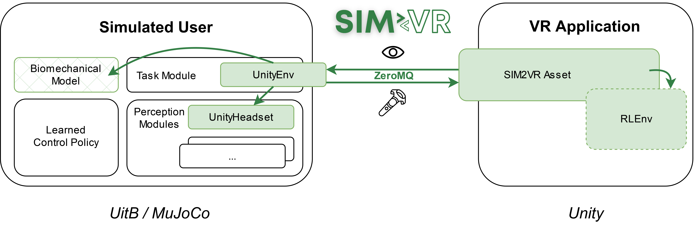

# SIM2VR: Towards Automated Biomechanical Testing in VR

SIM2VR is an extension of the [User-in-the-Box (UitB) framework](https://github.com/aikkala/user-in-the-box) for **integrating biomechanical simulations directly into Unity applications**. This is achieved by running the user simulation and the Unity application in separate processes (in parallel), while ensuring their temporal and spatial synchronicity.

By integrating biomechanical simulations into Unity applications, SIM2VR enables real and simulated users to perceive and control exactly the same virtual environment. This increases the ecological validity of simulation-based predictions for VR interaction. SIM2VR can be used to predict and analyse differences in performance and ergonomics between specific design choices, and to anticipate potential user strategies for a given VR application.

Paper link: [SIM2VR: Towards Automated Biomechanical Testing in VR (UIST 2024)](https://doi.org/10.1145/3654777.3676452)


## Citation
Please cite the following paper when using SIM2VR:

```
@inproceedings{FischerIkkala24,

author = {Fischer, Florian and Ikkala, Aleksi and Klar, Markus and Fleig, Arthur and Bachinski, Miroslav and Murray-Smith, Roderick and H\"{a}m\"{a}l\"{a}inen, Perttu and Oulasvirta, Antti and M\"{u}ller, J\"{o}rg},
title = {SIM2VR: Towards Automated Biomechanical Testing in VR},
year = {2024},
publisher = {Association for Computing Machinery},
address = {New York, NY, USA},
url = {https://doi.org/10.1145/3654777.3676452},
doi = {10.1145/3654777.3676452},
booktitle = {Proceedings of the 37th Annual ACM Symposium on User Interface Software and Technology},
numpages = {15},
location = {Pittsburgh, PA, USA},
series = {UIST '24}}
```


## Requirements and Scope

SIM2VR requires that the Unity application has an OpenXR plugin (min. version 1.5.3) to handle the VR device interaction. For the user simulation, any simulated user instance created within the [UitB framework](https://github.com/aikkala/user-in-the-box) can be used (min. version 2.0). Note that this requires the biomechanical model to be implemented in the [MuJoCo physics engine](https://mujoco.org/).

The current focus of SIM2VR is on movement-based VR interaction using VR controllers and an HMD. Since the UitB framework only includes visual and proprioceptive sensor modalities, SIM2VR is currently limited to the transmission of visual output signals from the VR application to the simulated user. However, we plan to support other feedback modalities such as auditory and haptic output in the future.


## Extending the UitB Framework



SIM2VR provides two new components to the UitB framework -- **UnityEnv** and **UnityHeadset** -- and a Unity asset **SIM2VR Asset**. 

- UnityEnv is a UitB task module that enables Unity applications to be used as the simulation environment. Specifically, UnityEnv communicates with the SIM2VR asset and exchanges information between the simulations: UnityEnv sends the HMD and controllers' pose to the Unity application, and receives the image rendered in the virtual HMD, a scalar reward, and other stateful information. Additionally, the UnityEnv module equips the biomechanical model with the virtual HMD and controllers.

- UnityHeadset is a UitB perception module that receives the visual observation from the Unity application through the UnityEnv module. UnityHeadset is a simple perception module that can e.g. filter color channels and stack multiple observations to allow the control policy to infer movement.

- SIM2VR Asset handles the communication with the UnityEnv task module, and provides an RLEnv class. This class must be inherited and implemented separately for each Unity application. All necessary functionality required for the RL training (e.g. proper initialisation and resetting, as well as the reward function) need to be defined within the inherited class.


## Step-by-Step Guide

In the following, we demonstrate how SIM2VR can be used to generate user simulations for a given Unity application.
As an example, we consider the Beat Saber-style game implemented in the [VR Beats Kit](https://assetstore.unity.com/packages/templates/systems/vr-beats-kit-168243), which is freely available on the Unity Asset Store.


### Step 1: Initialisation

1. Set up your Unity project for VR development with OpenXR. Follow e.g. [this video](https://www.youtube.com/watch?v=_WlykP-tYZg). Most importantly, you need to install the _OpenXR Plugin_ (min version 1.5.3) and _XR Interaction Toolkit_ through the Package Manager (_Window_ -> _Package Manager_).

2. Clone or download this repository, and import the _"sim2vr.unitypackage"_ into your Unity project (_Assets_ -> _Import Package_ -> _Custom Package ..._).

3. Add the _XR Origin_ rig through _GameObject_ -> _XR_ -> _XR Origin (Action-based)_

4. Add the _sim2vr_ prefab as a game object into the desired scene.

5. Connect the  _SimulatedUser_ fields to the _LeftHand Controller_, _RightHand Controller_ and _Main Camera_ of the _XR Origin_ rig, and to the _RLEnv_ of the _sim2vr_ game object.


### Step 2: Defining the Game Reward and Reset

To train a simulated user interact with the Unity application, appropriate reward and reset methods need to be defined. For this purpose, an application-specific class must be inherited from the _RLEnv_ class provided by the SIM2VR asset. Note that all game objects and variables relevant for the reward calculation must be accessible from this class. For example, if the distance of a game object to the controller is used as a reward, the game object's and controller's positions should be fields of this class.

The task-specific reward needs to be computed by the method _CalculateReward_ and stored in the variable _\_reward_. If a game score is provided by the VR application, this score can be directly used as reward (note that game scores typically accumulate points throughout the round, so the reward signal should be set to the increase in that score since the last frame). If necessary, the typically sparse game reward can be augmented by additional, more sophisticated terms, as described in the accompanying paper. In the VR Beats game, a player receives rewards for hitting approaching boxes. Each hit is worth 50-200 points, depending on the hit speed and direction. As the rewards accumulate throughout the game play, we use the difference between successive frames as the RL training reward.

The method _Reset_ needs to ensure that the entire scene is reset to a (reproducible) initial state at the end of each round (i.e., RL training episode). This usually includes the destruction of game objects created during runtime and resetting variables required to compute the game reward. All code related to resetting the game reward should be defined in the method _InitialiseReward_. Preparations for the next round, such as choosing a game level or defining variables required for the reward calculations, can also be defined here. Actions and settings that should be taken only once when starting the game can be defined in the method _InitialiseApplication_. For the VR Beats game, it is sufficient to simply invoke the existing _onRestart_ game event, which triggers the restart of the level in the _VR\_BeatManager_ and the _ScoreManager_, and set the current game score for reward calculation to 0 in the method _Reset_

Finally, the simulated user needs to be informed about whether the current episode has ended, i.e., the variable _\_isFinished_ needs to be updated accordingly within the method _UpdateIsFinished_. This is the approapriate method for logging other variables of interest as well, by saving them into the _\_logDict_ dictionary, which will be then uploaded into Weights&Biases. In the Beats VR game, we make use of the method _getIsGameRunning_ of the _VR\_BeatManager_ instance to track whether the episode has ended.


### Step 3: Further Adjustments

Since including an application- and task-dependent time feature (i.e., information regarding elapsed time or time remaining in the episode) as "stateful" information in the observation may help in training the simulated user, the RLEnv class provides a method _GetTimeFeature_ to define this time feature. Note that implementing this method for deterministic environments may lead to the simulated user exploiting this information instead of e.g. relying on visual perceptions. As the Beats VR game is such a deterministic environment, we did not define the time feature.

Often, a Unity application commences with an initial scene, such as a menu, rather than directly starting the game. As SIM2VR does not provide a mechanism to switch scenes, this needs to be manually implemented. If possible, this should be implemented in the _Reset_ function, otherwise, the application source code may need to be modified.

As the biomechanical model, we use a bimanual version of the [_MoBL\_ARMS_ model](https://github.com/aikkala/user-in-the-box/tree/main/uitb/bm_models/mobl_arms_bimanual_motor). Furthermore, to speed up the training, we replaced the muscle actuators with joint-wise torque actuators. Additionally, the Beats VR game includes walls that approach the player and must be dodged. As _MoBL\_ARMS_ model is a static upper body model, we chose to play only the first 10 seconds of the game, which do not contain these walls. The first 10 seconds include four boxes that approach the player and must be hit; if a box passes by the player without a hit, the game terminates.

The _Logger_ is optional and can be used to log individual trials, for example, when collecting data from a user study. It needs to be defined separately for each application, as the logged variables will be different.


### Step 4: Building the Unity Application

From the resulting Unity project augmented by the SIM2VR scripts and game objects, a standalone Unity Application can be built. This application is then used as interaction environment for the UitB simulated user during training.


### Step 5: Defining the Simulated User in UitB

After preparing the VR Interaction environment for running user simulations, a simulator needs to be created in [UitB](https://github.com/aikkala/user-in-the-box). 

All relevant information can be defined in the YAML config file (see [here](https://github.com/aikkala/user-in-the-box/tree/main?tab=readme-ov-file#building-a-simulator)). The config file used for the Beats VR game can be found [here](https://github.com/aikkala/user-in-the-box/blob/main/uitb/configs/mobl_arms_beatsvr_bimanual.yaml). Defining the YAML mainly involves:
- selecting a biomechanical user model (_bm\_model_), including the effort model (_effort\_model_) and effort cost weight (_weight_)
- selecting perception modules, including the  _vision.UnityHeadset_  module provided by SIM2VR (_perception\_modules_)
- providing the path of the standalone Unity Application to interact with (_unity\_executable_)

Other optional parameters include:
- optional arguments to be passed to the VR application (e.g., to set a specific game level or difficulty) (_app\_args_)
- the VR hardware setup (_gear_)
- the position and orientation of the VR controllers (_left\_controller\_relpose_, _right\_controller\_relpose_) relative to a body part included in the biomechanical user model (_left\_controller\_body_, _right\_controller\_body_)
- the position and orientation of the HMD (_headset\_relpose_) relative to a body part included in the biomechanical user model (_headset\_body_)
- RL hyperparameters (e.g., network size, time steps, batch size, etc.)

For the Beats VR game, we use the _MoblArmsBimanualMotor_ biomechanical model with neural effort costs, which penalize the sum of the squared muscle control signals at each time step. As perception modules, we use the default proprioception module and the _UnityHeadset_ vision module provided by SIM2VR. The former allows the simulated user to infer joint angles, velocities and accelerations, as well as muscle activations and index finger position. The latter is configured to include red color and depth channels of the RGB-D image, and stacked with a delayed (0.2 seconds prior) visual observation to allow the control policy to distinguish between left and right arm targets, and to infer object movement.


### Step 6: Training and Evaluation

The training can then be started by running the UitB Python script [_uitb/train/trainer.py_](https://github.com/aikkala/user-in-the-box/blob/main/uitb/train/trainer.py) and passing the configuration file as an argument.

Similarly, a trained simulator can be evaluated using the standard UitB script [_uitb/test/evaluator.py_](https://github.com/aikkala/user-in-the-box/blob/main/uitb/test/evaluator.py). The script runs the simulator/policy and optionally saves log files and videos of the evaluated episodes.

For better logging and evaluation, we recommend to connect a [Weights and Biases](https://wandb.ai/) account to the trainer.

For the Beats VR game, we trained three simulated users with neural effort cost weights 0.001, 0.01 and 0.05. This was done to demonstrate how the behaviour of the simulated user can range from an "explorative" or "enthusiastic" player to a more "lazy" player. The simulated users learned to hit the incoming targets using different strategies depending on the effort cost weight. For instance, the simulated user trained with the highest effort cost weight (0.05) learned to do only the bare minimum to move its arms and hit the incoming targets. In particular, it hit the targets by relying mostly on wrist movements, suggesting that the game design could benefit from modifying the target trajectories to force the players to move their arms more. The simulated users trained with lower effort costs learned to move their arms more, with the lowest effort leading to a policy where the arm movements are exaggerated. 

TODO: add videos

## Example: Whac-A-Mole
To train and evaluate simulated users for the Whac-A-Mole Unity game from the SIM2VR paper, please use the "whacamole" config files to be found [here](https://github.com/aikkala/user-in-the-box/blob/main/uitb/configs/). \
The source code of the game as well as the user data collected from the accompanying VR study can be found in the [Whac-A-Mole repository](https://github.com/aikkala/whac-a-mole).

TODO: add figure/videos

## Additional Tools
Both the _Reach Envelope_ and the _Reward Scaling_ tool described in the SIM2VR paper are publicly available from the [uitb-tools](https://github.com/aikkala/user-in-the-box/blob/main/uitb/configs/) repo. \
After installing the `uitb-tools` Python package, the respective Jupyter notebook files can be executed.

## Contributors
Florian Fischer*  
Aleksi Ikkala*  
Markus Klar  
Arthur Fleig  
Miroslav Bachinski  
Roderick Murray-Smith  
Perttu Hämäläinen  
Antti Oulasvirta  
Jörg Müller  

_(*equal contribution)_
